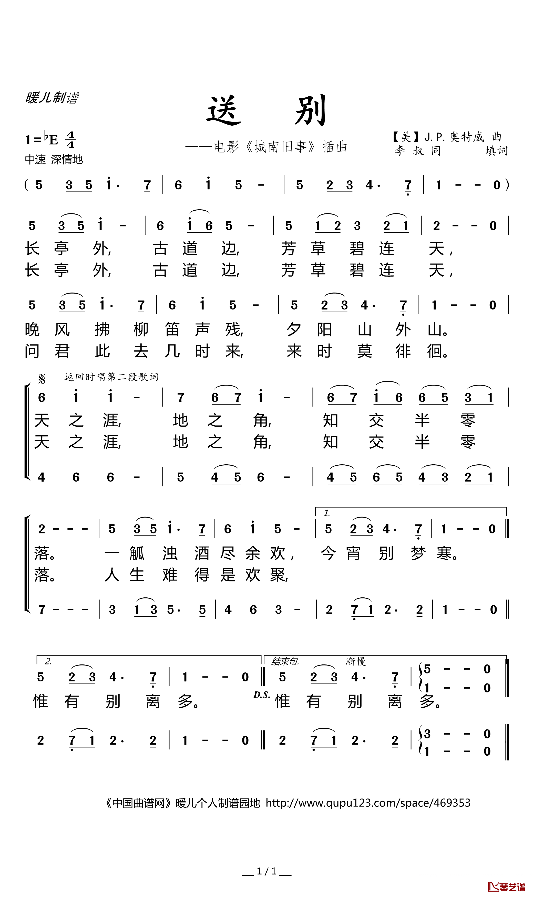
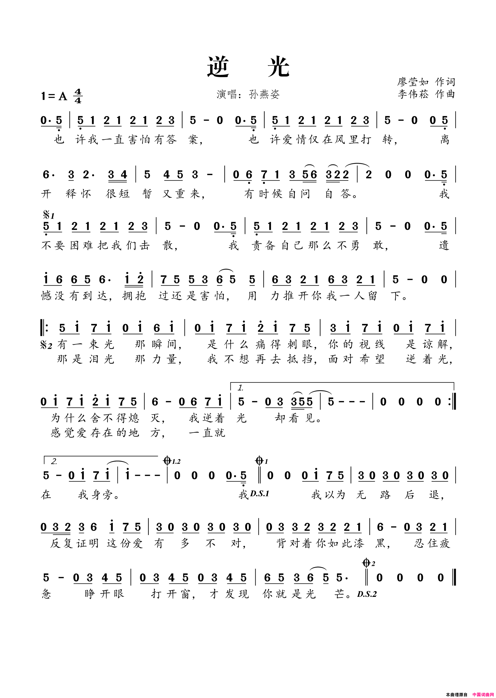
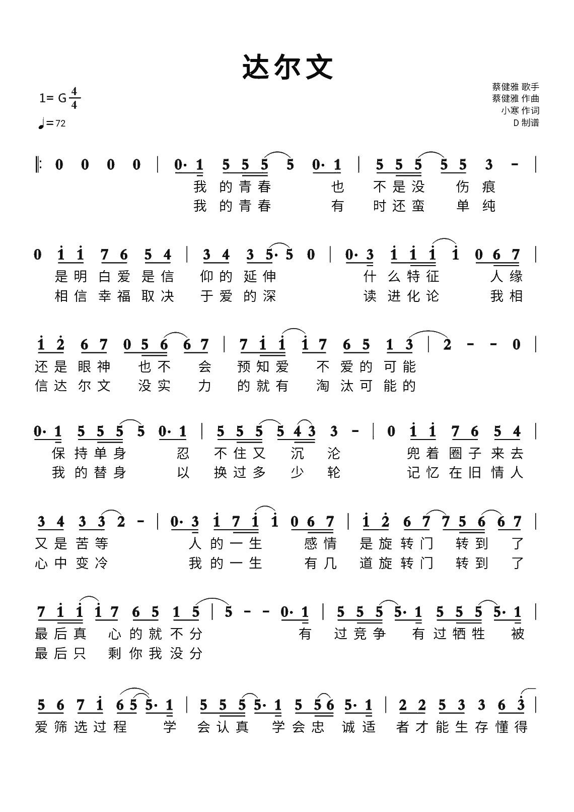
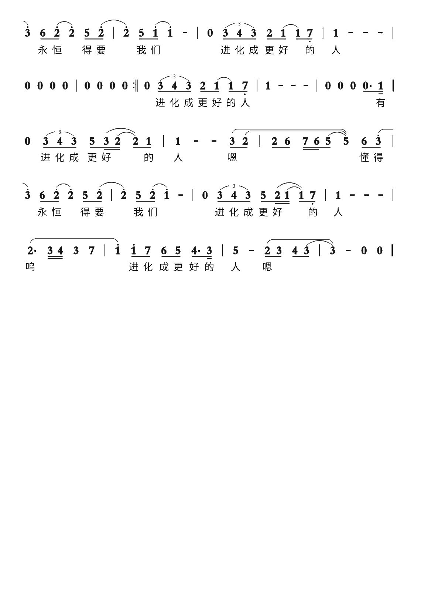

<div align="center">

# 🎹🤖 Galbot Piano

### 用 Galbot G1 灵巧手自动弹奏《小星星》《茉莉花》《送别》《逆光》《达尔文》

</div>

---

## 📖 项目简介

通过 galbot_sdk.g1 控制 **Galbot G1** 机器人的 **RH56 仿人五指灵巧手**，把双手架在钢琴琴键上，自动按时间线触发手指按下 / 归位指令，实现"机械手弹钢琴"。

整个项目分两部分：
- 🎹 弹奏脚本 (`main_code/`) — 五首曲子，每首自带 init/destroy，机器人复用
- 🌐 网页控制器 (`web/`) — 浏览器启动 / 停止 / 调次数 / 看实时日志，开机 systemd 自启

### ✨ 项目亮点

| 能力 | 说明 |
|---|---|
| 🎵 五首完整曲目 | 《小星星》《茉莉花》《送别》《逆光》《达尔文》 |
| 🎼 歌单自动编排 | loop_player.py 按 SCORES 顺序跑全部曲子, 一首歌跑多轮, 整张歌单再跑多轮 |
| 🌐 网页控制台 | 手机 / 电脑浏览器, 无需 SSH, 可调每首重复次数, 看实时 stdout 日志 |
| 🚀 开机自启 | systemd service, 机器人上电后自动起, 崩溃 5 秒后自愈 |
| 🤚 手部位移 | IK + 关节速度控制, 自动把左手左移 / 右手右移, 解决高低八度音 |
| ⏱ 智能调度 | 支持延音线、连音线、8 分音符、休止符 |
| ⚡ 速度可控 | move_hand_to 用 inverse_kinematics + set_joint_positions(speed_rad_s=...), 移动时间可预测 |
| 🛡 安全退出 | Ctrl+C 安全退出, 重置手部 + 释放资源, 全程 try/except 兜底 |

---

## 🎵 演示曲目

### 🌟《小星星》（Twinkle Twinkle Little Star）

`piano_extended.py` · 6 段 · 约 34 秒 · apscheduler 调度

简谱：
```
1 1 5 5 | 6 6 5 - |  4 4 3 3 | 2 2 1 - |
5 5 4 4 | 3 3 2 - |  1 1 5 5 | 6 6 5 - |
4 4 3 3 | 2 2 1 - ||  (A 段重复 5、6 段)
```

### 🌸《茉莉花》（Jiangsu Folk Song）

`main_code/molihua_hand_move.py` · 伴奏 + 独奏两轮 · 约 60 秒 · threading.Timer 手动调度


**特殊处理**：
| 简谱符号 | 处理方式 |
|---|---|
| 1· 高八度 Do (C5) | 右手小拇指按 position=600 (原位) |
| 2· 高八度 Re (D5) | 右手右移 -4.5cm, 弹原指位 |
| 5·6· 低八度 5/6 (G3/A3) | 左手左移 +7cm, 弹原指位 |
| - 延音线 | duration=2 + is_extended=True |
| ⌒ 连音线 | 第一个音 duration 标 True |

### 🍃《送别》（Farewell）

`main_code/farewell.py` · 简谱版 · threading.Timer 调度



### 💡《逆光》（Backlighting）

`main_code/backlighting.py` · 简谱版 · `PLAYBACK_REPEAT_COUNT = 3`（默认跑 3 轮）

> 注: 此曲脚本内复用《送别》的 SCORE 数据（逆光 (实为送别 SCORE)）, 只换了指法与时间线。



### 🧬《达尔文》（Darwin）

`main_code/darwin.py` · 蔡健雅 · threading.Timer 调度

> 本曲默认 `PLAYBACK_REPEAT_COUNT = 1`, 可在网页调整。




---

## 🚀 快速开始

### 硬件要求
- Galbot G1 机器人（双臂, 灵巧手集成）
- RH56 灵巧手 × 2（每只 6 个自由度）
- 钢琴（或电子琴）—— 把灵巧手按映射架在合适琴键位置上

### 软件要求
- Python 3.8+（系统自带, /usr/bin/python3）
- galbot_sdk（在 /data/galbot/lib, 用户 ~/.bashrc 已设 PYTHONPATH）
- apscheduler（仅《小星星》需要, `pip install apscheduler`）
- 浏览器（手机 / 电脑都行, 访问机器人 IP 的 8088 端口）

> **SDK 环境变量**：网页控制器的子进程会自动注入 `PYTHONPATH=/data/galbot/lib` 和 `LD_LIBRARY_PATH=/data/galbot/lib`, 不依赖登录 shell 的 bashrc。

### 灵巧手位置摆放

| 简谱 | 唱名 | 关节 | 舵机位置 |
|---|---|---|---|
| 1 | do (C4) | 左小拇指 (joint 5) | 700 |
| 2 | re (D4) | 左无名指 (joint 4) | 830 |
| 3 | mi (E4) | 左中指 (joint 3) | 850 |
| 4 | fa (F4) | 左食指 (joint 2) | 830 |
| 5 | sol (G4) | 右食指 (joint 2) | 830 |
| 6 | la (A4) | 右中指 (joint 3) | 850 |
| 7 | ti (B4) | 右无名指 (joint 4) | 830 |
| 1· | do (C5) | 右小拇指 (joint 5) | 600 |

> 位置值范围 0-1000, **1000 = 张开**, 数值越小越弯曲。具体数值由 RH56 灵巧手校准决定。

### 运行方式

#### 方式 1：网页控制台（推荐, 手机可访问）

```bash
# 一次性启动 (前台, SSH 内)
cd /userdata/cx/QZ_Piano/web && python3 server.py

# 或一次性后台 + 开机自启（推荐生产）
sudo systemctl enable --now qzpiano-web
```

浏览器打开 `http://<机器人IP>:8088`, 看到歌单 / 工具两个分区卡片, 点 "▶ 运行 ×N" 即开始弹奏。

详见 [web/README.md](web/README.md) 和 systemd 管理章节。

#### 方式 2：SSH 直接弹奏（开发调试）

```bash
# 歌单模式（按 SCORES 跑全部曲子, 跑多轮）
cd /userdata/cx/QZ_Piano/main_code
python3 loop_player.py --rounds 1 --playlist 2

# 单曲（经 wrapper 注入 PLAYBACK_REPEAT_COUNT, 不改原文件）
cd /userdata/cx/QZ_Piano/main_code
python3 Tools/run_score.py --script molihua_hand_move.py --repeat 3

# 单曲（直接调用, 使用原文件默认值）
cd /userdata/cx/QZ_Piano/main_code
python3 molihua_hand_move.py

# 小星星（传统入口, 历史保留）
cd /userdata/cx/QZ_Piano
python3 piano_extended.py
```

灵巧手会自动：
1. 初始化为全张开状态
2. 按时间线按下 / 归位对应手指
3. **茉莉花**：在高低八度音前自动平移手腕到合适位置
4. 弹奏完毕后恢复张开状态
5. 释放机器人资源

---

## 🌐 网页控制器（详细）

| 资源 | 说明 |
|---|---|
| 入口 | `http://<机器人IP>:8088` |
| 服务名 | `qzpiano-web.service` (systemd) |
| 服务文件 | `/etc/systemd/system/qzpiano-web.service` |
| 代码 | `web/server.py` (29KB, 仅标准库) |
| 前端 | `web/static/index.html` (35KB, 单文件) |
| 日志 | `/var/log/qzpiano-web.log` |
| 服务 README | [web/README.md](web/README.md) |

**功能**：
- 机器人连接状态实时探测（TCP / systemd 服务 / 关键进程）
- 歌单 + 工具两个分区卡片
- 每首钢琴卡片有 [−] [N] [+] 计数器, 数字存 localStorage 跨刷新保留
- ▶ 运行 ×N / ■ 停止 按钮
- 复位 / 张开手指工具按钮（含二次确认）
- 实时日志 tail（200KB 滚动, 切换卡片自动续接）
- 跨网络 IP 切换：输入 host:port 即应用, localStorage 记忆

**互斥与防误操作**：
- loop_player 与三首单曲 / 复位 / 张开手指互相排斥（同一时间机器人只能做一件事）
- 检测到 SSH 启动的外部进程时拒绝启动, 需用户先手动停掉
- 「停止」只对本控制器启动的进程生效

**手动管理服务**：
```bash
sudo systemctl status qzpiano-web     # 看状态
sudo systemctl restart qzpiano-web    # 改了 server.py 后重启
sudo systemctl stop qzpiano-web       # 停
sudo systemctl disable qzpiano-web    # 取消开机自启
tail -f /var/log/qzpiano-web.log      # 实时看日志
```

---

## 🏗 核心架构

### SDK 接口

```python
from galbot_sdk.g1 import ControlStatus, GalbotRobot, JointCommand

robot = GalbotRobot()
robot.init()                                       # 连真机
status = robot.set_dexhand_command(
    end_effector="left_dexhand",                   # 或 "right_dexhand"
    dexhand_command=[JointCommand(position=p) for ...],  # 6 元素列表
    is_blocking=False,
)
```

### 音符 → 手指 → 位置 映射（NOTE_MAP）

```python
NOTE_MAP = {
    1: left_pinky,      2: left_ring,      3: left_middle,
    4: left_index,      5: right_index,    6: right_middle,
    7: right_ring,      10: left_pinky_low, 11: left_pinky_low_2,  # 低八度
    1.5: right_pinky,                                                # 高八度
}
```

每只灵巧手 6 自由度：拇指旋转 / 拇指弯曲 / 食指 / 中指 / 无名指 / 小拇指
简谱数字直接映射到具体关节, **代码可读性高**。

### 拇指全程固定

```python
THUMB_ROTATION = 0       # 拇旋转固定 0（张开）
THUMB_FLEXION = 1000     # 拇弯曲固定 1000（张开）
```

整首曲子过程中拇指不动, **只靠其他 4 指按琴键**, 减少失控风险。

### 事件格式

```python
# 普通音: (note, duration)
(5, 0.7)         # 中央 sol, 按 0.7 秒（一拍）
# 延音: (note, duration, is_extended)
(5, 1.4, True)    # 按住 1.4 秒（2 拍）, 中间不归位
# 8 分音符: duration=0.35
(5, 0.35)
```

---

## ⚡ 速度控制（手部位移）

### 核心思路

钢琴高低八度音需要手在 x 方向平移几厘米。**与其扩展 NOTE_MAP 映射 4 套手指, 不如让手整体平移**：
- IK 解出平移目标 pose → set_joint_positions(speed_rad_s=...) → 可预测时长
- 在 lookahead 阶段判断下个音是否需要移位, 提前触发

### 关键参数

| 参数 | 默认 | 说明 |
|---|---|---|
| LEFT_HAND_OFFSET_LEFT | +0.07 m | 左手左移距离（低八度音）|
| RIGHT_HAND_OFFSET_RIGHT | -0.045 m | 右手右移距离（高八度 Re）|
| HAND_MOVE_SPEED_RAD_S | 0.4 rad/s | 关节速度 |
| HAND_MOVE_DELAY | 0.3 s | 速度控制后预计手部到位时间 |

### 移位管理（带 lookahead）

```python
cur_needs_left  = note in [10, 11]   # 当前音需左移
next_needs_left = (next_note in [10, 11]) if next_note is not None else False

if cur_needs_left and not left_hand_moved:
    target = list(left_origin_pose); target[1] += LEFT_HAND_OFFSET_LEFT
    move_hand_to(motion, robot, target, G1JointGroup.left_arm)
    time.sleep(HAND_MOVE_DELAY)
    left_hand_moved = True
elif not cur_needs_left and not next_needs_left and left_hand_moved:
    # 当前不需要、下一个也不需要 → 回原位
    move_hand_to(motion, robot, list(left_origin_pose), G1JointGroup.left_arm)
    time.sleep(HAND_MOVE_DELAY)
    left_hand_moved = False
```

---

## 📊 两种调度方案对比

| 维度 | piano_extended.py (apscheduler) | molihua_hand_move.py (threading.Timer) |
|---|---|---|
| 调度器 | apscheduler.BackgroundScheduler | threading.Timer 手动调度 |
| 触发频率 | INTERVAL=0.7s 固定 | INTERVAL=0.7s 基准 |
| 跨事件 | 长事件会跳 fire | duration × INTERVAL - actual_time |
| 延音线 | 用 is_extended=True 模拟 | 原生支持 |
| 连音线 | gap=0.15s | 0.5 拍间隔 0.35s |
| 手部位移 | 无 | IK + 速度控制 |
| 8 分音符 | 简化处理 | duration=0.5 |

**选择建议**：
- **入门 / 演示**：用 piano_extended.py（简单稳定）
- **复杂曲目 / 需要严格节奏**：用 molihua_hand_move.py（Timer 精确控制）
- **多曲连续跑**：用 loop_player.py（编排器）
- **手机 / 远程控制**：用网页控制器（web/）

---

## 📁 文件清单

```
/userdata/cx/QZ_Piano/                    (本仓库根目录)
├── README.md                              本文档
├── .gitignore                             Python 忽略
├── main_extended_molihua.py               (历史) 茉莉花基础版, apscheduler 调度
├── molihua_hand_move.py                   (历史) 茉莉花早期版
├── piano_extended.py                       小星星最终版, apscheduler 调度
├── piano_test.py                           小星星早期版, 3-tuple 事件格式
│
├── main_code/                             钢琴脚本主目录
│   ├── loop_player.py                     歌单编排器（按 SCORES 跑全部曲子）
│   ├── molihua_hand_move.py               茉莉花（Timer 调度, 手部位移）
│   ├── farewell.py                        送别（Timer 调度）
│   ├── backlighting.py                    逆光（Timer 调度, PLAYBACK_REPEAT_COUNT=3）
│   └── darwin.py                          达尔文（Timer 调度, PLAYBACK_REPEAT_COUNT=1）
│
├── Tools/                                 辅助工具脚本
│   ├── get-hand-posion.py                 读取当前灵巧手末端位姿
│   ├── move-hand-posion.py                让手到固定位姿 + 平移测试
│   ├── set_whole_joints_to_zero.py        全身归零（参考, 仅 motion.move_whole_body_joint_zero）
│   ├── reset_to_initial.py                复位：FIRST_POSITION → move_whole_body_joint_zero
│   ├── open_hands.py                      张开手指（拇旋转=0, 其余=1000）
│   └── run_score.py                       单曲包装器, 注入 PLAYBACK_REPEAT_COUNT 不改原文件
│
├── sources/                               源资源
│   ├── emotion_movement.py                情感动作（头部摇, 手臂外摆）调度参考
│   ├── head_positions.json                头部姿态关键帧
│   └── mjcf/                              MJCF 仿真模型（galbot_g1_v2_2_1.xml 等）
│       └── meshes/v2_2_1/
│       └── tools/galbot_ge101in_description/
│
├── musical_score/                         简谱配图（PNG）
│   ├── molihua.png, farewell.png
│   ├── backlighting.png
│   └── darwin-1.png, darwin-2.png
│
├── web/                                   网页控制器（推荐生产用）
│   ├── README.md                          服务 + 前端 + systemd 全部说明
│   ├── server.py                          HTTP 服务（Python 3.8 标准库, 无外部依赖）
│   ├── static/index.html                  前端（vanilla HTML+CSS+JS, 单文件）
│   ├── logs/                              运行时日志（每个脚本一个 .log）
│   └── backups/                           钢琴脚本备份（含 original tarball）
│       └── originals_20260923_141849.tar.gz
│
└── WorkLog/                               工作日志
    └── WORK_LOG.md                          完整开发日志（含踩过的坑、调试记录）
```

### 部署路径

```bash
# 主代码在 /userdata/cx/QZ_Piano/（即本仓库根目录）
# 网页控制器 systemd 单元在 /etc/systemd/system/qzpiano-web.service
# 服务日志在 /var/log/qzpiano-web.log
# 机器人 SDK 在 /data/galbot/lib（g1 版本, 由 .bashrc 自动 PYTHONPATH）
```

---

## 🐛 已踩过的坑（详见 WorkLog/WORK_LOG.md）

### 坑 A：ControlStatus.SUCCESS vs MotionStatus.SUCCESS
**问题**：原版用 ControlStatus.SUCCESS 与 motion.get_end_effector_pose_on_chain() 返回值比较 → 永远是 False（不同枚举）  
**修复**：分开 import, motion 相关用 MotionStatus.SUCCESS, set_dexhand_command 用 ControlStatus.SUCCESS

### 坑 B：低八度 5/6 与中央 5/6 混淆
**问题**：hit_next 触发条件原本是 `note in [5, 6]`, 导致"好一朵美丽的茉莉花"的 5/6 也错误触发手部移位  
**修复**：触发条件改为 `note in [10, 11]`, SCORE 中低八度音改用 10/11 编号

### 坑 C：get_command_for_note 错误重映射
**问题**：原版 `if note == 5: return NOTE_MAP[1]` —— 把中央 5 错误重映射到左手小拇指  
**修复**：简化为 `return NOTE_MAP.get(note)`, NOTE_MAP 本身已按编号映射好手指关节

### 坑 D：延长音"幽灵按下"
**问题**：第 1 段末尾延长音 G4 让右食指持续按下 2 拍, 第 2 段全在左手操作 → 右食指未显式归位  
**修复**：延长音 2 拍 hold 结束后显式调用 hit() 归位

### 坑 E：网页服务端 SDK 导入失败
**问题**：用 subprocess.Popen 启子进程时, 不走 bashrc, 找不到 galbot_sdk  
**修复**：在 server.py 的 start_script() 里给子进程显式注入 PYTHONPATH=/data/galbot/lib 和 LD_LIBRARY_PATH=/data/galbot/lib

### 坑 F：网页 URL 自动检测不稳定（手机热点切换）
**问题**：DHCP 分配 IP 变化后, 浏览器还在访问旧 IP → 连不上  
**修复**：服务端 /api/status 返回所有接口 URL, 前端提供"服务器地址"输入框 + localStorage 记忆, 跨域通过 CORS 头允许

---

## 🎛 参数调优

| 参数 | 默认 | 适用 | 说明 |
|---|---|---|---|
| INTERVAL | 0.7 | 所有 | 一拍时长（秒）, 决定整体速度 |
| RESET_DELAY | 0.55 | 所有 | 按下后归位等待（需 ≥ 物理松开时间）|
| HAND_MOVE_SPEED_RAD_S | 0.3-0.4 | molihua | 手部位移速度（弧度/秒）|
| HAND_MOVE_DELAY | 0.3 | molihua | 手部位移后等待时间 |
| LEFT_HAND_OFFSET_LEFT | +0.07 | molihua | 左手左移距离（米）|
| RIGHT_HAND_OFFSET_RIGHT | -0.045 | molihua | 右手右移距离（米）|
| PLAYBACK_REPEAT_COUNT | 1 / 3 (backlighting) | 单曲 | 每首曲子弹几遍 |
| PLAYLIST_REPEAT_COUNT | 2 | loop_player | 整张歌单跑几轮 |

---

## 🚧 已知问题 / 待优化

1. **高八度 6· 还没特殊处理**：当前弹成中央 A4, 如需弹 A5 需扩展 NOTE_MAP
2. **IK 失败兜底**：当前 IK 失败时仅打印日志并 return, 可在异常位姿处加入回退
3. **物理伺服校准**：NOTE_MAP[1] (700) 和 NOTE_MAP[2] (830) 需上机验证响应
4. **真实节拍细化**：当前简化处理 8 分音符, 可扩展支持 16 分音符（duration=0.25）
5. **网页计数默认值不统一**：molihua/farewell/darwin 默认 1 次, backlighting 默认 3 次（与源码一致）。网页显示的"默认次数"与原文件 PLAYBACK_REPEAT_COUNT 绑定, 改一处需同步另一处

---

## 🔮 扩展方向

- 🎼 更多曲目：生日快乐、致爱丽丝、欢乐颂等
- 🎚 力度控制：用 JointCommand.effort 字段实现强弱拍
- 📡 状态反馈：用 get_dexhand_state 读取实际位置做闭环控制
- 🎤 实时识谱：摄像头读取乐谱 → 自动转 SCORE 事件
- 🤖 双手协调：用 motion_plan_multi_waypoints 同步双手位姿
- 📊 网页可视化：实时显示手指落下位置、灵巧手状态图、当前曲目进度条

---

## 📜 License

MIT

---

## 🙏 致谢

- 🤖 Galbot — G1 机器人 SDK
- 🦾 因时机器人 Inspire — RH56 灵巧手
- 🌸 茉莉花旋律 — 江苏民歌（何仿改编, 祖英演唱版）
- 🍃 送别旋律 — 李叔同（电影《城南旧事》插曲）
- 💡 逆光旋律 — 范玮琪
- 🧬 达尔文旋律 — 蔡健雅
- 🌟 网页控制器（web/）— 由 Codex 协助设计实现, 含 systemd 开机自启、CORS、跨 IP 切换、按曲调计数等功能
